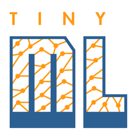

# TinyML

## Возможности
Tiny Machine Learning (или `TinyML`) - это машинное обучение на **микроконтроллерах** с низкими вычислительными ресурсами и сверхнизким энергопотреблением. Основными преимуществами TinyML являются:

- **Компактные модели**, которые легко использовать на микроконтроллерах.
- Решения производятся локально и с **низкой задержкой**, что устраняет необходимость передачи данных в облако.
- Задачи машинного обучения **выполняются локально**, устраняя необходимость передачи или хранения конфиденциальных пользовательских данных.
- Микроконтроллеры имеют **низкую стоимость**, что существенно облегчает внедрение приложений машинного обучения в больших масштабах.

## Области применения

`TinyML` чаще всего используется в следующих областях, которые называют `"три V"`:

- голос (`Voice`),
- зрение (`View`),
- вибрация (`Vibration`).

## Полезные ссылки
- Pete Warden and Daniel Situnayake. TinyML: Machine Learning with TensorFlow Lite on Arduino and Ultra-Low-Power Microcontrollers. 2020.
- Джан Йодиче: TinyML. Книга рецептов. 2023. [TinyML-Cookbook](https://github.com/PacktPublishing/TinyML-Cookbook)
- [TinyML. Сжимаем нейросеть](https://habr.com/ru/companies/glowbyte/articles/559400/)
- [Второе чувство: разработка ИИ-носа](https://habr.com/ru/companies/first/articles/582246/)
- [TinyML — машинное обучение на микроконтроллерах](https://habr.com/ru/companies/first/articles/665932/)
- [Gesture Recognition with M5Stack + TensorFlow Lite](https://www.hackster.io/boochowp/gesture-recognition-with-m5stack-tensorflow-lite-da212b)
- [Что такое TinyML и что в нем такого важного?](https://habr.com/ru/companies/otus/articles/540276/)