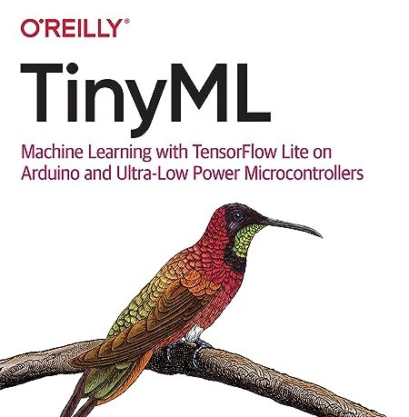

# TFLite Micro



[TFLite](https://www.tensorflow.org/lite?hl=ru) в настоящее время является основной средой для `TinyML`, предлагая поддержку микроконтроллеров, встроенных платформ Linux, Android и iOS.

- [TensorFlow Lite Micro for Espressif Chipsets](https://github.com/espressif/tflite-micro-esp-examples)

## Установка `TFLite`

- [Установить ESP-IDF](../ref/esp_idf.md#install)
- Клонировать проект

```bash
$ cd proj
$ git clone https://github.com/espressif/tflite-micro-esp-examples
$ cd tflite-micro-esp-examples/
$ git submodule update --init --recursive
```
- Установить переменные окружения и проверить версию

```bash
$ . $HOME/esp/esp-idf-v5.0.2/export.sh
$ idf.py --version
ESP-IDF v5.0.2-dirty
```
## Примеры
- [TensorFlow Lite для микроконтроллеров](https://www.tensorflow.org/lite/microcontrollers?hl=ru)
### Hello World

```bash
$ cd examples/hello_world/
$ idf.py set-target esp32s3
```
- Сборка
```bash
$ idf.py build
```
- Загрузить программу

```bash
$ idf.py --port /dev/ttyUSB0 flash monitor
```

### Person detection
```bash
$ cd examples/person_detection/
$ idf.py set-target esp32s3
```
- Конфигурация (проверить тип SPIRAM)
```bash
$ idf.py menuconfig
```
- Сборка
```bash
$ idf.py build
```

- Загрузить программу

```bash
$ idf.py --port /dev/ttyUSB0 flash monitor
```
- Вывод
```bash
>> detect_image 9
Total time = 54
FC time = 0
DC time = 24
conv time = 29
Pooling time = 0
add time = 0
mul time = 0
person score:82%, no person score 18%
I (6710) [esp_cli]: Time required for the inference is 56 ms

```

## Другие примеры

